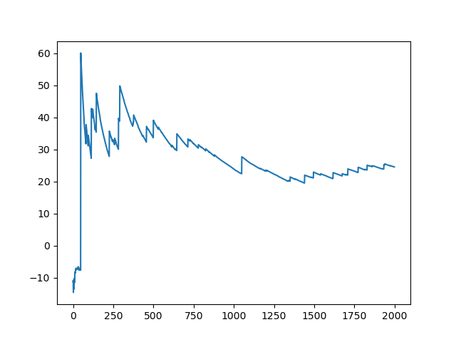

## Monte Carlo Control

1. Average Undiscounted Rewards across 10 runs, per episode:

    - Test conditions:
        - Terminal reward is 50 (hitting the goal), -50 (getting into a hole); -0.1 for getting stuck, and -0.01 for taking a step
        - We update policy after each episode.
        - An exponential decay policy of $\epsilon$ is adopted, so the final policy will converge greedily. (GLIE)
    - A few things to note:
        - The curve settles at ~18. This shows that after 2000 episodes, the algorithm converges. It's negative because of the penalties above.
1. Visualize an Episode:

    <div style="display: flex; justify-content: center;">
        
        
    </div>

1. Importance Sampling:
    1. We use a random behavior policy b(a|s) = 0.25 for every a and s
    2. Generate episodes using the behavior policy to evaluate the last epsilon-greedy policy found above.
        - **I'm assuming the target policy with $\epsilon=0.2$. Otherwise, a deterministic policy may yield a lot of zeros in value**
    3. With ordinary importance sampling Monte Carlo prediction, then with the weighted importance sampling 
        1. run the algorithms for 2000 episodes across 10 runs.
        2. Plot the average **off policy Monte Carlo estimates of V π (s)** for s = 0 against the number
of episodes.
            
        3. In theses plots, include the standard deviation as a confidence band. 
            - For example, if experiments is an array containing 10runs × 2000episodes value estimates, then you may use the following function:
    4. Implementation:
        ```python
        V = [[0,0,...], [0,0...]]
        For each episode:
            for each (s,a,r):
                G = r + gamma * G
                get target probability
                get weight 
                Update G: target_G_function[s][a] = weight * G
        V /= Episode_num 
        ```

4. Implement the Every visit Monte Carlo prediction algorithm in order to estimate V π (s).
    1. Train the algorithm for 10000 episodes, and plot the learning curves for each s of V π (s)
over the number of episodes. The result should be 1 figure, with 16 curves plotted inside
it (one for each state, x-axis is the 10000 episodes, y-axis is the current estimate of
V π (s)).
    2. Include the plot containing the learning curves for each s of V π (s)
    3. Visualize the final learned value function for each (put the values in a grid like
Table 2). Intuitively, do these values make sense